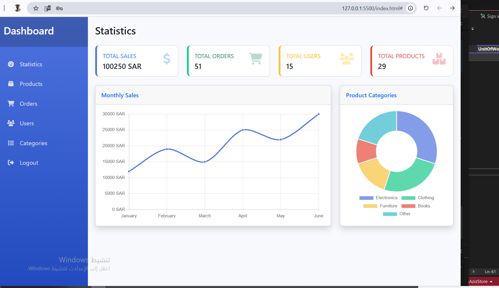
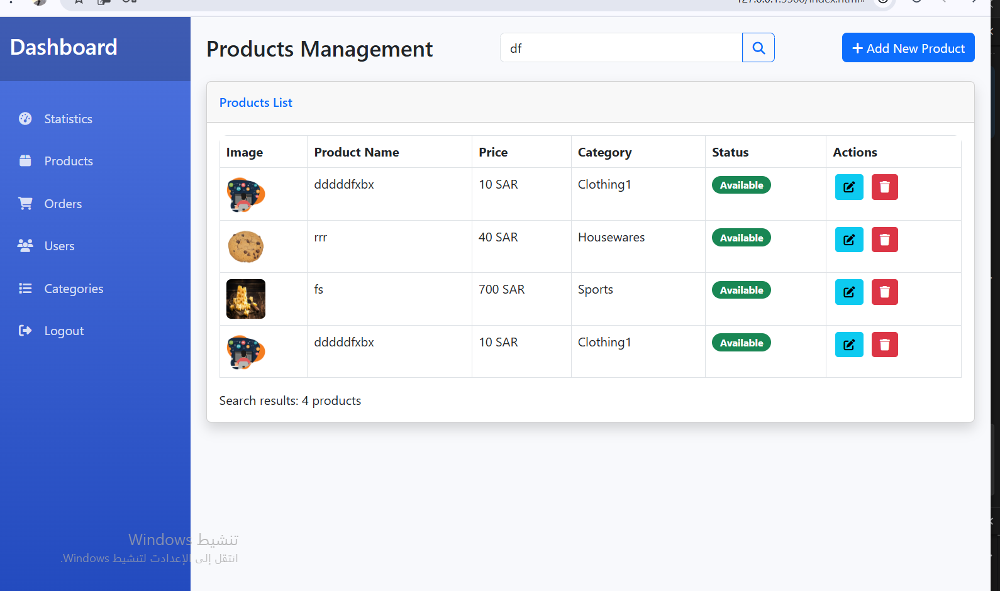

# 🛒 E-commerce Admin Dashboard

A comprehensive and responsive **admin dashboard** for managing an e-commerce store, built with modern web technologies.

---

## 🌟 Features

- **Modern User Interface:** Sleek and intuitive design  
- **Secure Authentication:** JWT token-based login system  
- **Complete Management:**  
  - 📦 Products (view, add, edit, delete)  
  - 🛒 Orders (view, search, cancel, delete)  
  - 👥 Users (view, add, edit, delete)  
  - 📂 Categories (view, add, edit, delete)  
- **Dashboard Analytics:** Interactive charts for sales and distribution data  
- **Fully Responsive:** Works on all screen sizes and devices  

---

## 🛠 Technologies Used

- **Frontend:** HTML5, CSS3, JavaScript (ES6+)  
- **Framework:** Bootstrap 5.3.0  
- **Charts:** Chart.js  
- **Icons:** Font Awesome 6.4.0  
- **Styling:** CSS Custom Properties  
- **Data Transfer:** RESTful API  

---

## 📦 API Endpoints Used

| Function          | Method | Endpoint                                |
|-------------------|--------|-----------------------------------------|
| **User Login**    | POST   | `/api/Auth/Login`                       |
| **Dashboard Stats** | GET   | `/api/UserAccount/DashboardStats`       |
| **Products List** | GET    | `/api/Product/paged`                    |
| **Add Product**   | POST   | `/api/Product`                          |
| **Edit Product**  | PUT    | `/api/Product/{id}`                     |
| **Delete Product**| DELETE | `/api/Product/{id}`                     |
| **Orders List**   | GET    | `/api/Order/paged`                      |
| **Cancel Order**  | PUT    | `/api/Order/CancelOrder/{id}`           |
| **Delete Order**  | DELETE | `/api/Order/{id}`                       |
| **Users List**    | GET    | `/api/UserAccount/paged`                |
| **Add User**      | POST   | `/api/UserAccount`                      |
| **Edit User**     | PUT    | `/api/UserAccount/{id}`                 |
| **Delete User**   | DELETE | `/api/UserAccount/{id}`                 |
| **Categories List** | GET  | `/api/Category`                         |
| **Add Category**  | POST   | `/api/Category`                         |
| **Edit Category** | PUT    | `/api/Category/{id}`                    |
| **Delete Category**| DELETE| `/api/Category/{id}`                    |

---

## 📸 Screenshots


```markdown



*Dashboard with Analytics*


*Products Management Page*


*Orders Management Page*
